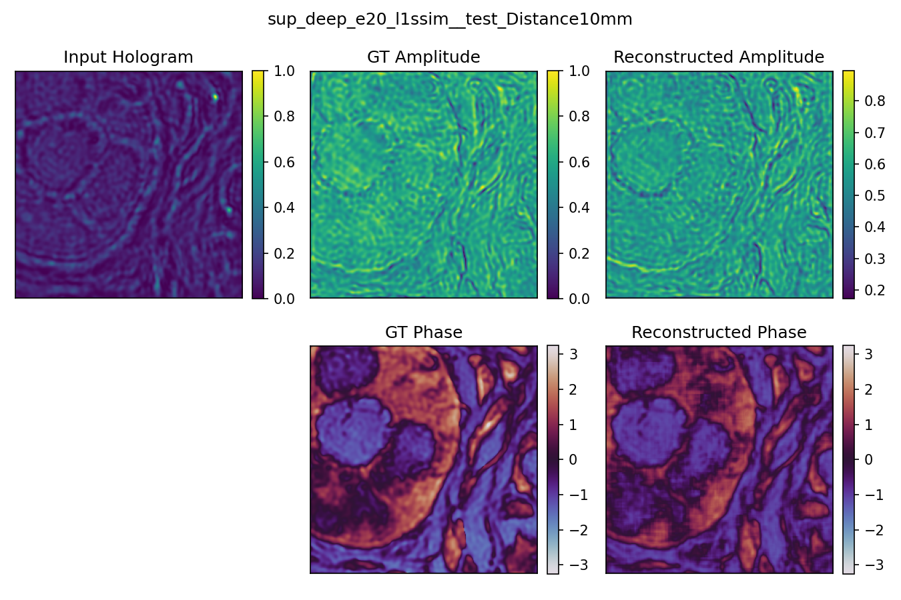
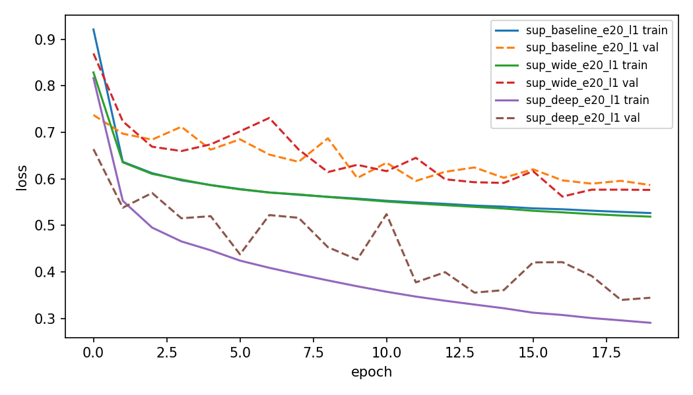
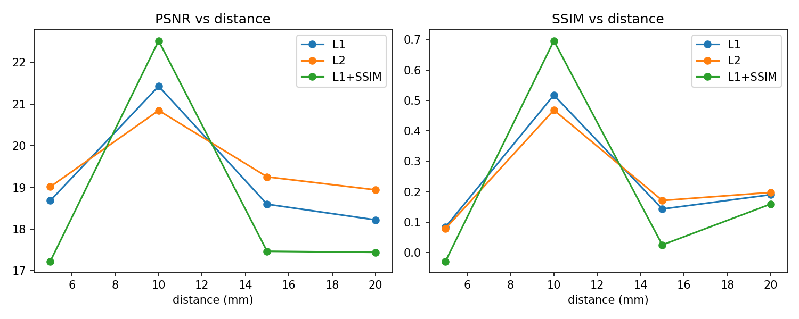
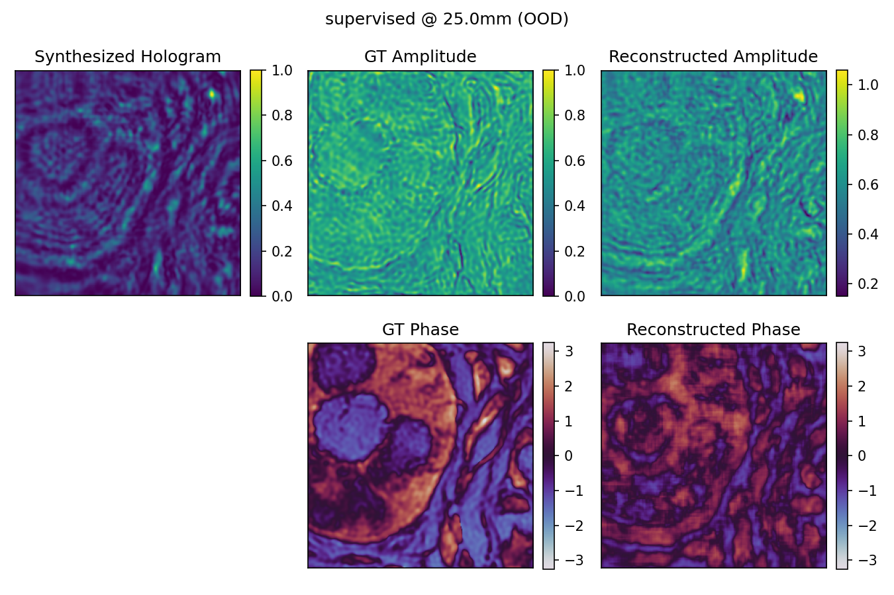
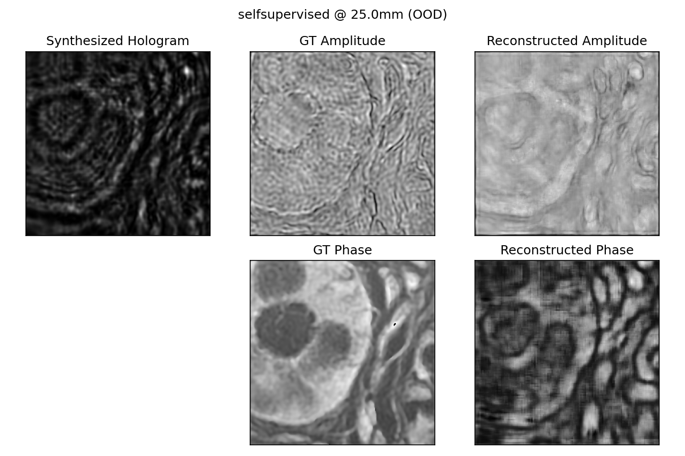

# Deep Learning for Digital Holographic Reconstruction

Reconstructing the amplitude and phase of light from a single intensity-only
hologram, for label-free imaging of tissue histology slides — comparing a
supervised approach against a physics-informed self-supervised approach that
uses no real hologram data at all.


*Input hologram (intensity only) -> reconstructed amplitude and phase, vs. ground truth.*

**Headline result**: a supervised U-Net trained at a single distance (10mm)
reaches the best in-distribution quality (SSIM 0.70 with an L1+SSIM loss) but
its SSIM collapses to near-zero (-0.03 to 0.19) at distances just 5mm away.
A self-supervised model trained across a continuous 5-20mm range never
matches that peak, but stays flat (SSIM 0.26-0.31) across the entire range —
and at two distances *outside even that range* (2mm, 25mm), it beats the
supervised model on both PSNR and SSIM. Robustness and peak accuracy traded
directly against each other.

> This project is a ground-up redo of a graduate course assignment I
> completed and submitted in May 2025 (KAIST, "AI in Biomedical Imaging").
> My original report is kept as-is at
> [`original_submission/original_report.pdf`](original_submission/original_report.pdf)
> for reference. Everything else in this repository — code, experiments,
> writeup — was rebuilt independently for this project.

## Why this problem is hard

A camera can only measure light *intensity*; the *phase* of the field —
which encodes the tissue's refractive-index structure — is destroyed at the
moment of measurement, and the light further diffracts as it travels from the
sample to the sensor. Recovering the original complex field from a single
diffracted intensity pattern is a classic ill-posed inverse problem in
computational imaging. Full derivation and the physics behind the forward
model used here: [`docs/background.md`](docs/background.md).

## Two approaches, compared

| | Supervised | Self-supervised |
|---|---|---|
| Trains on | Real (hologram, ground-truth field) pairs, single fixed distance (10mm) | Only ground-truth fields; holograms synthesized on the fly at a randomly sampled distance via a differentiable physics forward model (Angular Spectrum Method) |
| Learns | A direct mapping for the one distance it saw | A mapping expected to hold across a *range* of distances |
| Risk | May not generalize to other sensor distances | Depends on how faithful the physics simulator is |

The physics forward model (`src/physics.py`) was validated against real
measured 10mm holograms before being trusted for training: **Pearson
correlation r = 0.997** between simulated and real holograms of the same
object.

## Results

All numbers are PSNR / SSIM on reconstructed amplitude, averaged over the
50-image test set at each distance (evaluation metrics always differ from
whatever loss trained the model, per the assignment's requirement). Full
tables and per-sample reconstruction figures: [`results/tables/`](results/tables/),
[`results/figures/`](results/figures/); figures below are regenerated by
[`notebooks/02_results.ipynb`](notebooks/02_results.ipynb).

### 1-1: Network architecture (baseline / wide / deep U-Net, L1, 20 epochs, @10mm)

| Model | Depth x Width | PSNR | SSIM |
|---|---|---|---|
| Baseline | 2 stages, 64-128ch | 20.62 | 0.391 |
| Wide | 2 stages, 128-256ch | 20.79 | 0.409 |
| Deep | 3 stages, 64-128-256ch | **21.43** | **0.517** |

Going deeper helped noticeably more than going wider at equal-ish parameter
budgets (wide: 1.6M params, deep: 1.9M params) — depth, not raw capacity, is
what let the network model the increasingly non-local diffraction structure.



### 1-2: Training length (deep, L1, @10mm)

| Epochs | PSNR | SSIM |
|---|---|---|
| 10 | 20.90 | 0.472 |
| 20 | 21.43 | 0.517 |
| 50 | **21.80** | **0.561** |

Monotonic improvement, no overfitting yet visible even at 50 epochs on this
1500-image training set — validation loss kept tracking training loss down.

### 1-3: Loss function (deep, 20 epochs, @10mm — evaluated on PSNR/SSIM, never the training loss itself)

| Loss | PSNR | SSIM |
|---|---|---|
| L1 | 21.43 | 0.517 |
| L2 | 20.85 | 0.468 |
| L1+SSIM | **22.52** | **0.696** |

Adding a structural-similarity term to the loss gave the single largest jump
in reconstruction quality of any change in this whole project — but see 1-4:
this is also the model that generalizes worst. (Sample reconstruction from
this model is the hero image at the top of this README.)

### 1-4: Generalization to unseen distances (5 / 15 / 20mm)

| Loss | 5mm | 10mm (trained) | 15mm | 20mm |
|---|---|---|---|---|
| L1 | 18.68 / 0.084 | 21.43 / 0.517 | 18.60 / 0.143 | 18.22 / 0.190 |
| L2 | 19.01 / 0.079 | 20.85 / 0.468 | 19.25 / 0.171 | 18.94 / 0.198 |
| L1+SSIM | 17.22 / **-0.029** | **22.52 / 0.696** | 17.47 / 0.025 | 17.44 / 0.160 |

*(PSNR / SSIM.)* Every model's quality collapses once tested even 5mm away
from its training distance — SSIM drops by 3-25x. The L1+SSIM model, the
best performer at 10mm, is also the *most* fragile outside it (SSIM briefly
goes slightly negative — worse than an unstructured baseline). L2 degrades
the least in relative terms, consistent with it never having chased
structural sharpness as hard in the first place. This is the clearest
evidence in the project that a single-distance supervised model has learned
something closer to "invert this specific diffraction pattern" than "invert
diffraction."



### 2-1: Self-supervised training across distance configurations

Trained on synthetic holograms only (real ones never seen), sampling a
distance per batch either from a fixed point or a continuous range, then
evaluated at all four real test distances (PSNR / SSIM):

| Trained on | 5mm | 10mm | 15mm | 20mm |
|---|---|---|---|---|
| 5mm only | **21.24 / 0.605** | 17.54 / 0.094 | 17.86 / 0.195 | 17.61 / 0.217 |
| 10mm only | 19.35 / 0.103 | 20.65 / 0.385 | 19.49 / 0.225 | 18.99 / 0.209 |
| 15mm only | 19.87 / 0.256 | 20.20 / 0.276 | **20.29 / 0.284** | 19.96 / 0.265 |
| 20mm only | 20.28 / 0.320 | 19.87 / 0.234 | 20.07 / 0.266 | **19.95 / 0.273** |
| 5-20mm (continuous) | 20.15 / 0.285 | 20.39 / 0.306 | 20.18 / 0.272 | 19.90 / 0.259 |

The fixed-distance self-supervised models show the same peaked-at-training-
distance pattern as the supervised model (most pronounced for 5mm, the
easiest/least-diffracted case). The model trained across the continuous
5-20mm range never wins at any single distance, but its SSIM only varies by
0.05 across all four — the flattest curve of anything in this project.

### 2-2: Distance estimation (auto-focus proxy)

| True distance | Predicted (mean) | MAE | MSE |
|---|---|---|---|
| 5mm | 11.86mm | 6.86 | 47.14 |
| 10mm | 14.86mm | 4.86 | 25.78 |
| 15mm | 14.53mm | 1.00 | 1.34 |
| 20mm | 15.03mm | 4.97 | 27.28 |

The low MAE at 15mm is misleading: the network predicts roughly **12-15mm
for every input**, regardless of true distance (5-20mm training range, model
collapsed toward the middle of it). 15mm's low error is a coincidence of the
prediction landing near the truth, not evidence the network learned distance
from the hologram. A shallow CNN regressing a single global scalar off
intensity statistics alone does not reliably solve this task — a real
auto-focus system would need either more capacity, an explicit multi-scale/
sharpness cue, or a different training distribution.

### Extra credit: Out-of-distribution robustness (2mm / 25mm)

Ground-truth fields are identical across all `test/Distance*` folders (same
50 tissue objects; verified `np.allclose`), so holograms at distances with no
real data (2mm, 25mm) were synthesized via the same validated physics model:

| Distance | Supervised (10mm only) | Self-supervised (5-20mm) |
|---|---|---|
| 2mm | 17.47 / 0.205 | **18.71 / 0.211** |
| 25mm | 17.38 / 0.157 | **19.83 / 0.260** |

The self-supervised model wins on both metrics at both distances — including
25mm, which is 25% farther outside its own training range than 2mm is on the
near side. Training against a *range* of the physical parameter, even
without ever seeing the extremes, bought real headroom past the edges of
that range; training against one real-world condition did not.

| Supervised @ 25mm (OOD) | Self-supervised @ 25mm (OOD) |
|---|---|
|  |  |

## What I learned

Going in, I expected "self-supervised" to mean "worse but data-free" and
"supervised" to mean "better but narrow." The actual finding was sharper than
that: the single-distance supervised model isn't a slightly-narrower version
of a good reconstructor, it's a model that has overfit to one specific
diffraction geometry — move 5mm and its SSIM does not gracefully degrade, it
falls off a cliff (0.70 -> 0.03 at the extreme). The self-supervised model
never reaches that peak, but nothing in its accuracy curve depends on being
exactly at one distance, because nothing in its training did either.

The distance-regression result (2-2) taught me the more general lesson: a
model can produce a low-MAE-looking table while having learned nothing
resembling the intended task -- it just needs to guess a value near the
center of its training distribution's most common outcomes. I only caught
this because I plotted predictions per input distance instead of trusting
the aggregate MAE number, which is now something I check by default.

If I extended this project, the two things I'd try first: (1) a hybrid loss
that keeps L1+SSIM's in-distribution sharpness but penalizes divergence
across a couple of sampled off-distance reconstructions, to see if the
fragility in 1-4 is inherent to the loss or just to the single-distance
training data; (2) giving the depth regressor an explicit multi-scale
sharpness feature instead of raw intensity, since a real auto-focus system
almost certainly needs a stronger signal than what a 2-layer CNN can extract
globally.

## Repository structure

```
holographic-reconstruction/
  original_submission/        my original KAIST course submission (May 2025), for reference
  docs/background.md          background on holography, the phase problem, and the ASM forward model
  src/
    datasets.py                paired and field-only .mat dataset loaders
    physics.py                  differentiable Angular Spectrum Method forward model
    models.py                    parametrized U-Net (baseline/wide/deep via config)
    losses.py                     L1 / L2 / L1+SSIM training losses
    metrics.py                     PSNR / SSIM evaluation (kept separate from training losses)
    train_supervised.py            tasks 1-1, 1-2, 1-3
    train_selfsupervised.py        task 2-1
    train_depth_regressor.py       task 2-2
    evaluate.py                     runs a checkpoint against a test-distance split
    evaluate_ood.py                  extra credit: supervised vs. self-supervised at 2mm/25mm
  scripts/run_all_experiments.sh   reproduces the entire experiment matrix
  notebooks/                        data exploration + final results figures
  results/                          metrics tables, figures, training logs (checkpoints gitignored)
```

## Reproducing this

Dataset (not included -- KAIST course material, not redistributed):
```
Data/
  train/{field,inten}/*.mat        # 1500 pairs, 10mm
  valid/{field,inten}/*.mat        # 20 pairs, 10mm
  test/Distance{5,10,15,20}mm/{field,inten}/*.mat   # 50 pairs each
```
`.mat` files use keys `"field"` (complex64, ground-truth amplitude+phase) and
`"inten"` (real, measured hologram intensity).

```bash
pip install -r requirements.txt
bash scripts/run_all_experiments.sh   # full matrix, ~6h on one GPU
```

Or run individual pieces, e.g.:
```bash
python src/train_supervised.py --run_name deep_l1ssim --arch deep --loss l1+ssim --epochs 20
python src/evaluate.py --checkpoint results/supervised/deep_l1ssim/best.pth --arch deep --test_split test/Distance10mm --run_name deep_l1ssim
```

## Acknowledgments

Dataset and assignment framing from KAIST's "AI in Biomedical Imaging" course
(Instructor: Mooseok Jang). This repository is an independent, from-scratch
reimplementation done to build a deeper understanding of the material, not a
copy of the original course submission.
